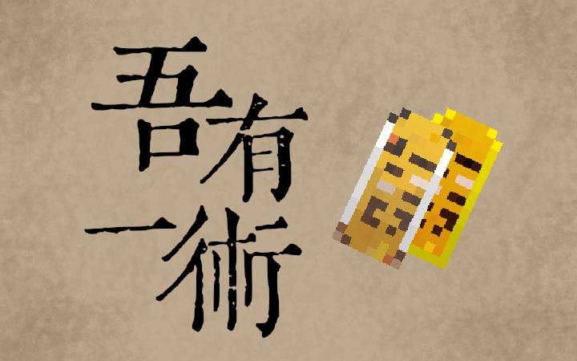

<h1>Wenyan Nature   
     
</h1>

Wenyan Nature is a Minecraft mod that inspired by the [Wenyan language](https://github.com/wenyan-lang/wenyan).
Using Wenyan language, this mod can let player create wonderful magic by handling complex logic of the magic.

The mod is still in development.

## TODO

- [ ] Add TODO (?)

## License

This project is licensed under the LGPL-3.0 license. See the `LICENSE` file for details.
