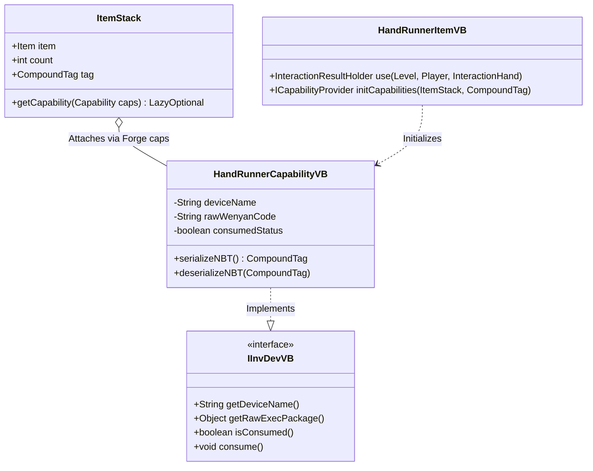

```mermaid
classDiagram
    class ItemStack {
        +Item item
        +int count
        +CompoundTag tag
        +getCapability(Capability caps) LazyOptional
    }

    class IInvDevVB {
        <<interface>>
        +String getDeviceName()
        +Object getRawExecPackage()
        +boolean isConsumed()
        +void consume()
    }

    class HandRunnerItemVB {
        +InteractionResultHolder use(Level, Player, InteractionHand)
        +ICapabilityProvider initCapabilities(ItemStack, CompoundTag)
    }

    class HandRunnerCapabilityVB {
        -String deviceName
        -String rawWenyanCode
        -boolean consumedStatus
        +serializeNBT() CompoundTag
        +deserializeNBT(CompoundTag)
    }

    ItemStack o-- HandRunnerCapabilityVB : Attaches via Forge caps
    HandRunnerItemVB ..> HandRunnerCapabilityVB : Initializes
    HandRunnerCapabilityVB ..|> IInvDevVB : Implements
```
