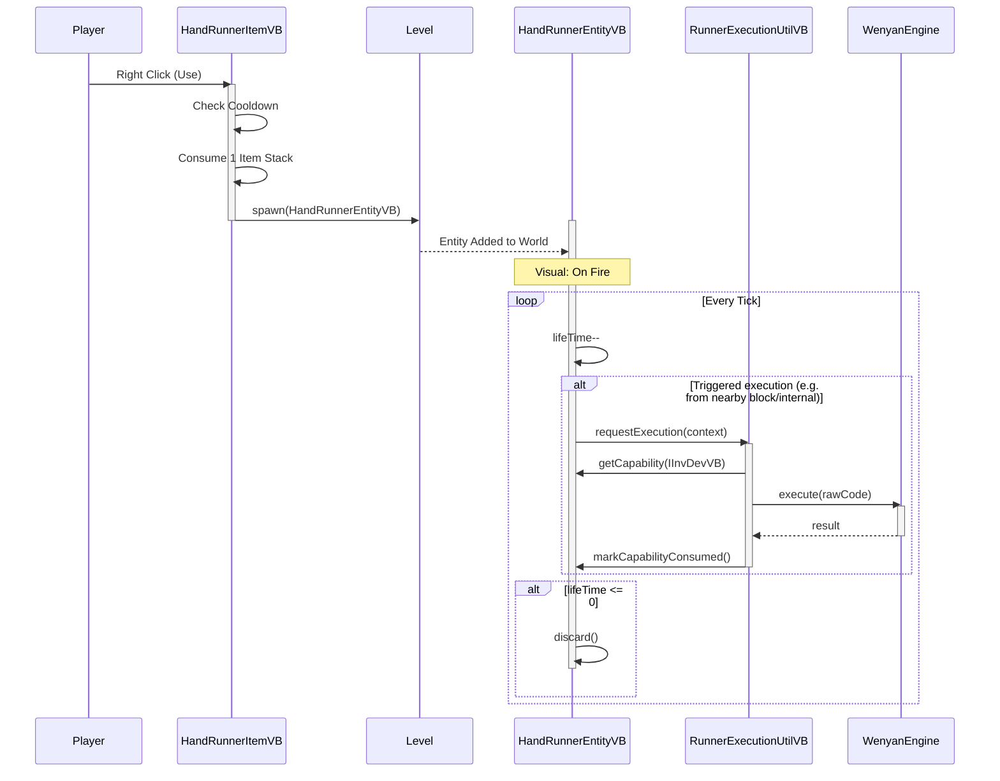

```mermaid
sequenceDiagram
    participant Player
    participant HandRunnerItemVB
    participant Level
    participant HandRunnerEntityVB
    participant RunnerExecutionUtilVB
    participant WenyanEngine

    Player->>HandRunnerItemVB: Right Click (Use)
    activate HandRunnerItemVB
    HandRunnerItemVB->>HandRunnerItemVB: Check Cooldown
    HandRunnerItemVB->>HandRunnerItemVB: Consume 1 Item Stack
    HandRunnerItemVB->>Level: spawn(HandRunnerEntityVB)
    deactivate HandRunnerItemVB
    
    activate HandRunnerEntityVB
    Level-->>HandRunnerEntityVB: Entity Added to World
    Note over HandRunnerEntityVB: Visual: On Fire

    loop Every Tick
        HandRunnerEntityVB->>HandRunnerEntityVB: lifeTime--
        
        alt Triggered execution (e.g. from nearby block/internal)
            HandRunnerEntityVB->>RunnerExecutionUtilVB: requestExecution(context)
            activate RunnerExecutionUtilVB
            RunnerExecutionUtilVB->>HandRunnerEntityVB: getCapability(IInvDevVB)
            RunnerExecutionUtilVB->>WenyanEngine: execute(rawCode)
            activate WenyanEngine
            WenyanEngine-->>RunnerExecutionUtilVB: result
            deactivate WenyanEngine
            RunnerExecutionUtilVB->>HandRunnerEntityVB: markCapabilityConsumed()
            deactivate RunnerExecutionUtilVB
        end

        alt lifeTime <= 0
            HandRunnerEntityVB->>HandRunnerEntityVB: discard()
            deactivate HandRunnerEntityVB
        end
    end
```
