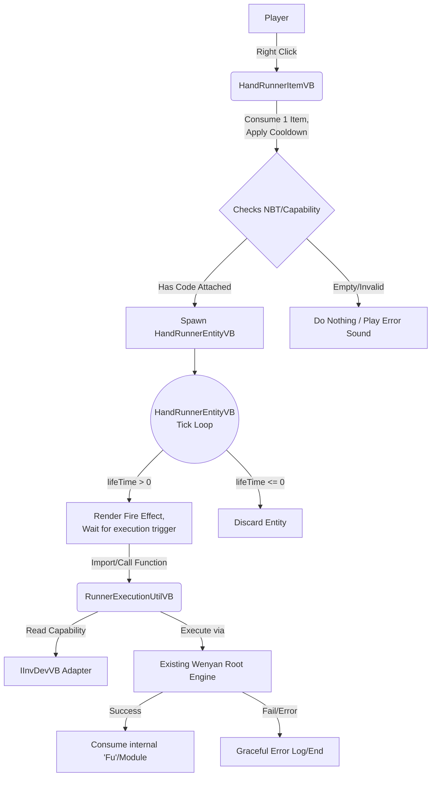

```mermaid
graph TD
    A[Player] -->|Right Click| B(HandRunnerItemVB)
    B -->|Consume 1 Item,<br>Apply Cooldown| C{Checks NBT/Capability}
    
    C -->|Has Code Attached| D[Spawn HandRunnerEntityVB]
    C -->|Empty/Invalid| E[Do Nothing / Play Error Sound]

    D --> F((HandRunnerEntityVB<br>Tick Loop))
    F -->|lifeTime > 0| G[Render Fire Effect,<br>Wait for execution trigger]
    F -->|lifeTime <= 0| H[Discard Entity]

    G -->|Import/Call Function| I(RunnerExecutionUtilVB)
    I -->|Read Capability| J[IInvDevVB Adapter]
    I -->|Execute via| K[Existing Wenyan Root Engine]

    K -->|Success| L[Consume internal 'Fu'/Module]
    K -->|Fail/Error| M[Graceful Error Log/End]
```
