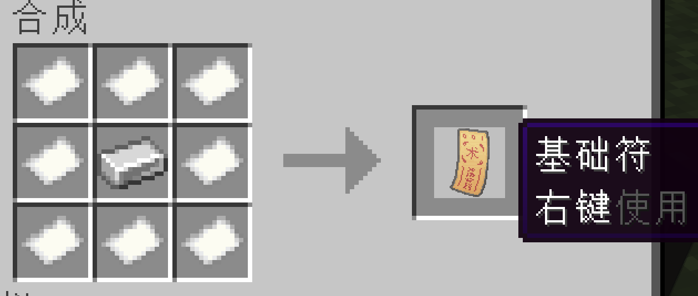
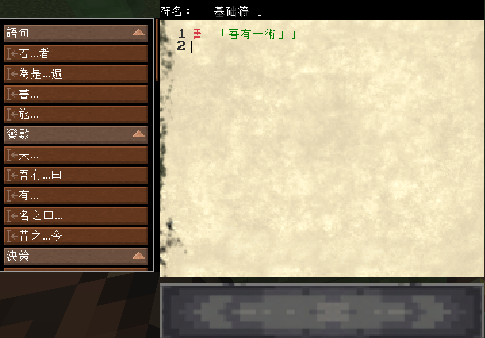
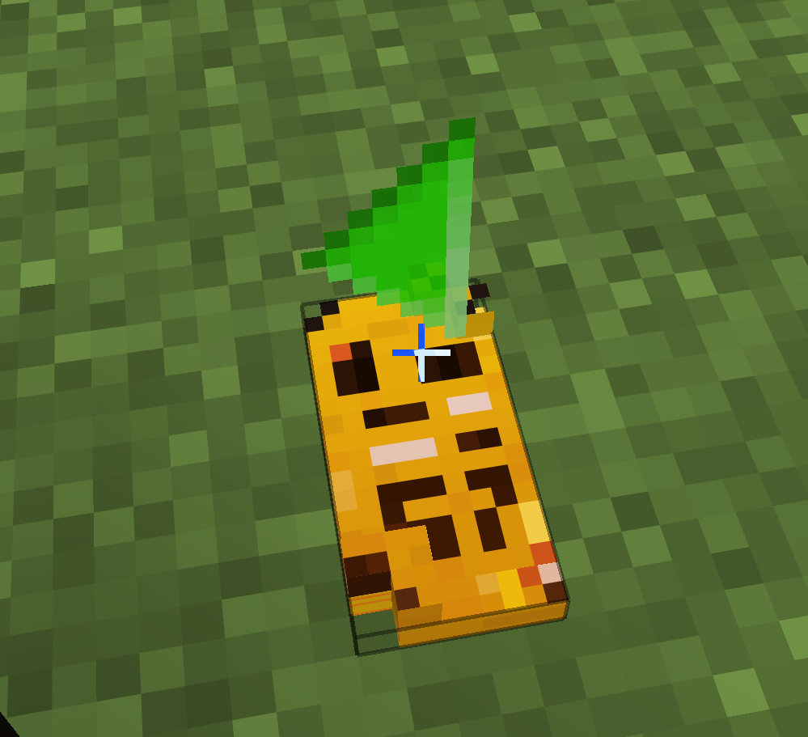
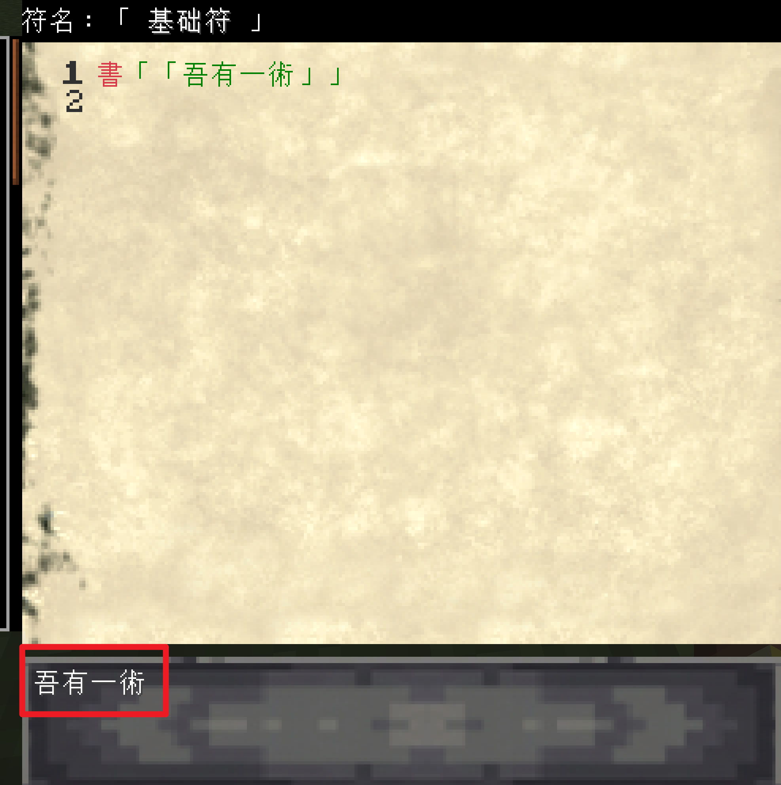

> 千里之行，始于足下。

# 本节目标

这一小节我们会制作第一个符咒。 

这个符咒的内容很简单，会在屏幕上输出 **吾有一术**。四个字。


# 合成第一个符咒


合成第一个符咒，你需要下列材料：
```
1x 铁锭
8x 纸
```


# 编写符咒内容

将符咒放在地上，编写下列内容：
```wenyan
書「「吾有一術」」
```

这句话的意思是：把「吾有一术」显示出来。

其中 `書` 可以先理解成“写出来”或“显示出来”。


*书写内容*

*符咒正常运行中*

*成功输出*

# 完成第一个符咒
恭喜你，成功完成了第一个符咒，正式踏上了《吾有一术》的探索旅程。

当然这还是非常基础的符咒，接下来我们会更进一步，了解符咒还能做什么有趣的事情！


# 常见问题和注意事项
指令需要使用繁体中文编写，简体中文仍在适配中。
如果你运行时候报错，尝试检查字体是不是繁体中文，有没有漏引号或者其他内容。